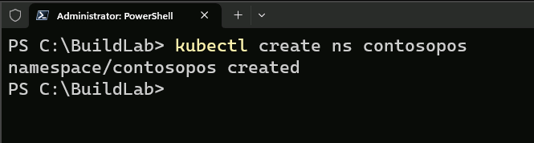
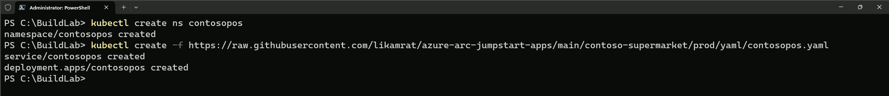
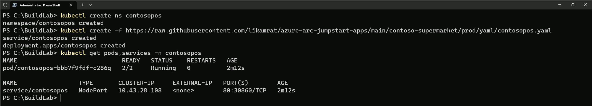
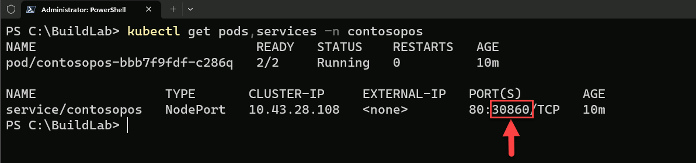
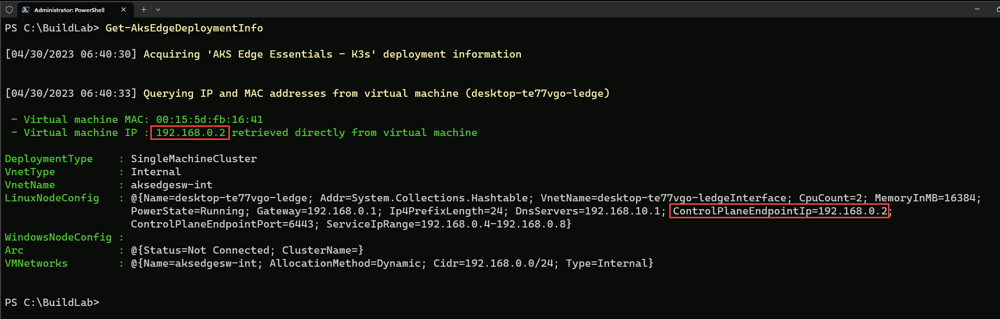
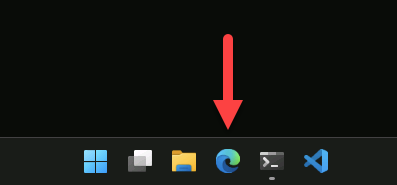
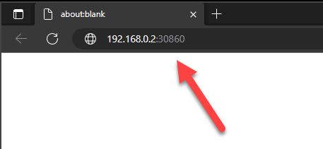
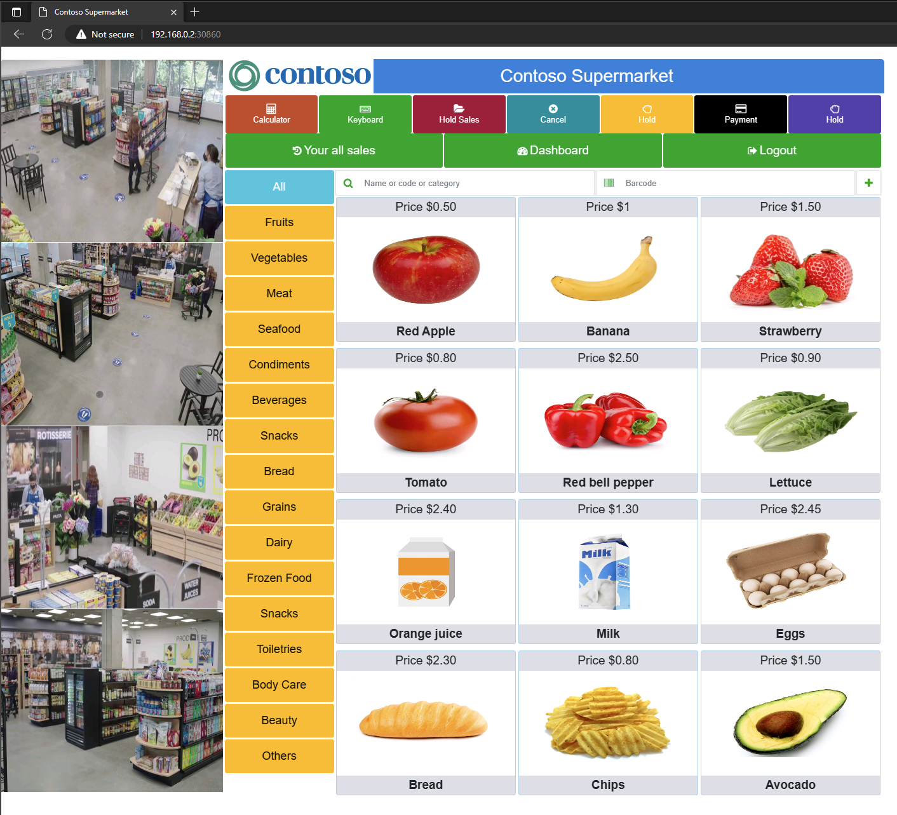

In this module, you will:

- Deploy the Contoso Supermarket web application

### Instructions

1. In this module, you will deploy and access a sample application to better understand the targeted use cases for AKS Edge Essentials. First, create a new _contosopos_ namespace using the below _kubectl_ command.

    ```cmd
    kubectl create ns contosopos 
    ```

    

    | ℹ️ Note                                   | 
    |------------------------------------------|
    | _POS (Point of Sale) software is the operating system you use to manage physical stores and sell in person. It’s what store staff use to find products, add them to a customer’s order, and accept payments. POS software also has helpful tools like sales reporting, inventory management, and integrated loyalty programs._ | 
    | | 

2. Next, deploy the application using the below _kubectl_ command.

    ```cmd
    kubectl create -f https://raw.githubusercontent.com/likamrat/azure-arc-jumpstart-apps/main/contoso-supermarket/prod/yaml/contosopos.yaml
    ```

    

3. Before opening the application in the browser, let's review the deployment using the below _kubectl_ command. We can see we have one pod with two replicas and a service deployed.

    | ℹ️ Note                                   | 
    |------------------------------------------|
    | _It might take a couple of minutes for all resources to be deployed._ | 
    | |

    ```cmd
    kubectl get pods,services -n contosopos
    ```

    

4. To access the application in the Microsoft Edge browser, let's review the IP address and port we will use. As you can see, the _contosopos_ service is deployed with a type of **_NodePort_**. This means that in addition to the port number the service is being redirected to, we also need the AKS-EE node IP address. Take note of the service-targeted port. For example, **_30860_**.

    

5. As you already know, AKS-EE has a dedicated PowerShell module to allow you also to interact with the deployed cluster. To retrieve the cluster Linux node IP, use the below PowerShell command. We can see our node IP (which is the Kubernetes Control Plane IP as well), is **_192.168.0.2_**.

    ```powershell
    Get-AksEdgeDeploymentInfo
    ```

    

6. It's time to open the application. Using the Microsoft Edge browser, navigate to the **_192.168.0.2_** IP address while using the _contosopos_ service introduced in step #4. For example, **_192.168.0.2:30860_**.

    
    
    
    
    

### **Congratulations, you have now deployed a sample POS application on your newly created AKS Edge Essentials cluster!**