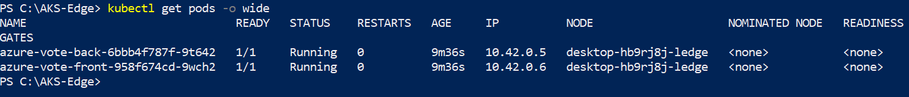
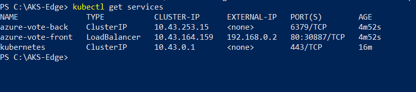
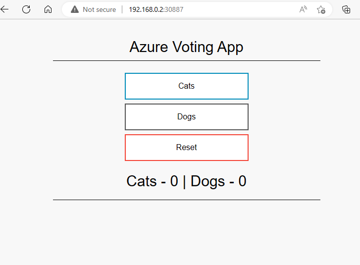

This section uses a sample application that is a simple voting app consisting of a front and back end, which is based on Microsoft's azure-vote-front image. The container image for this application is hosted on Azure Container Registry (ACR). See [linux-sample.yaml](https://github.com/Azure/AKS-Edge/blob/main/samples/others/linux-sample.yaml) in the GitHub repo package for the deployment manifest. Note that in the YAML we specified a nodeSelector tag as Linux.

### Instructions

1. Deploy the application

    | ℹ️ Note                                   | 
    |------------------------------------------|
    | _To deploy your application, use the kubectl apply command. This command parses the manifest file and creates the defined Kubernetes objects._ | 

    ```bash
    kubectl apply -f  https://raw.githubusercontent.com/Azure/AKS-Edge/main/samples/others/linux-sample.yaml
    ```

2. Verify the pods - Wait a few minutes for the pods to be in the running state:

    ```bash
    kubectl get pods -o wide
    ```
    
    

3. Verify the services - To monitor progress, use the `kubectl get services` command with the `--watch` parameter.

    ```bash
    kubectl get services --watch
    ```

    

    Initially, the `EXTERNAL-IP` for the **azure-vote-front** service is shown as pending. When the `EXTERNAL-IP` address changes from pending to an actual public IP address, you can use the IP address assigned to the service.

    | ℹ️ Note                                   | 
    |------------------------------------------|
    | _On single machine clusters, if you deployed your Kubernetes cluster without specifying a -ServiceIPRangeSize, you will not have allocated IPs for your workload services and you won't have an external IP address. In this case, find the IP address of your Linux VM (Get-AksEdgeNodeAddr)._ | 
    | |

4. Test your application - To see the application in action, open a web browser to the external IP address of your service

    

5. Remove application - To clean up, delete all resources using the following command:
    ```bash
    kubectl delete -f https://raw.githubusercontent.com/Azure/AKS-Edge/main/samples/others/linux-sample.yaml
    ```