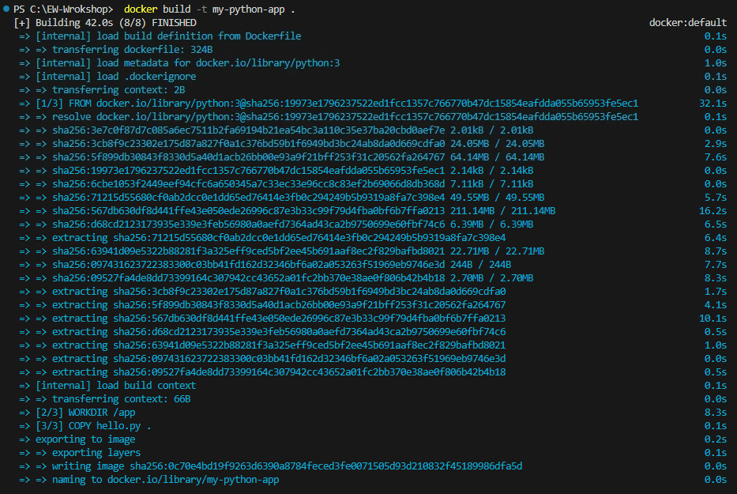

The first step is to create a simple Python script that you want to run inside the container. 

1. Open Visual Studio Code

1. Create a working directory folder, and open that directory. For exmaple `C:\BuildLab`

1. Create a file named `hello.py` with the following content:

    ```python
    print("Hello, Embedded World!")
    ```

1. Open the Visual Studio Code Terminal - Go to **View** -> **Terminal**

1. Run your application locally to ensure its compiling and working

    ```powershell
    python hello.py
    ```

    If everything is fine, you should see the following output

    ```powershell
    PS C:\BuildLab>  python hello.py
    Hello, Embedded World!
    ```

1. Once your application runs correctly, we need to package the application into a contianer. Create a **Dockerfile** in the same directory as your Python script. This file contains instructions for building your Docker image. 

    Here's an example Python Dockerfile:

    ```yaml
        # Use the official Python image from the Docker Hub
        FROM python:3

        # Set the working directory inside the container
        WORKDIR /app

        # Copy the Python script into the container
        COPY hello.py .

        # Run the Python script when the container starts
        CMD ["python", "hello.py"]
    ```

1. To build the contianer, open a terminal in the directory containing your Dockerfile and run the following command to build your Docker image:

    ```powershell
    docker build -t my-python-app .
    ```

    

1. Check that the container image was correctly created

    ```powershell
    docker images
    ```

    If everything is fine, you should see your image **my-python-app** listed. 

    ```powershell
    PS C:\BuildLab> docker images
    REPOSITORY                               TAG          IMAGE ID       CREATED         SIZE
    my-python-app                            latest       f80b669f78ed   5 seconds ago   1.02GB
    ```

1. Once the image is built, you can run a container based on that image. Use the following command to run the container:

    ```powershell
    docker run my-python-app
    ```

    You should see the output **"Hello, Docker!"** printed to the console, indicating that your Python script ran successfully inside the container.